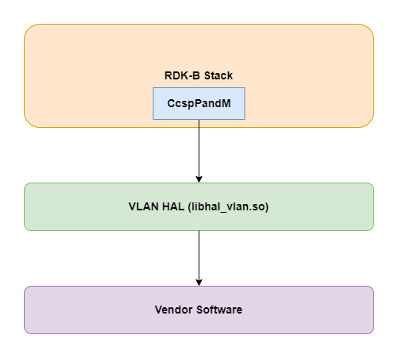
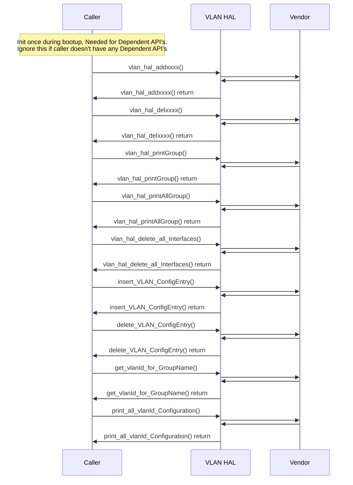

# VLAN HAL Documentation

## Acronyms

- `HAL` \- Hardware Abstraction Layer
- `RDK-B` \- Reference Design Kit for Broadband Devices
- `OEM` \- Original Equipment Manufacture

## Description
The diagram below describes a high-level software architecture of the VLAN HAL module stack.

VLAN HAL is an abstraction layer, implemented to interact with the underlying software through a standard set of APIs to add / delete / print VLAN group / interface.

## Component Runtime Execution Requirements

### Initialization and Startup

3rd party vendors will implement appropriately to meet operational requirements. This interface is expected to block if the hardware is not ready.

## Threading Model

The interface is not thread safe.

Any module which is invoking the VLAN HAL api should ensure calls are made in a thread safe manner.

Different 3rd party vendors allowed to create internal threads to meet the operational requirements. In this case 3rd party implementations should be responsible to synchronize between the calls, events and cleanup the thread.

## Process Model

All API's are expected to be called from multiple process.

## Memory Model

The client module is responsible to allocate and deallocate memory for necessary API's as specified in API Documentation.

Different 3rd party vendors allowed to allocate memory for internal operational requirements. In this case 3rd party implementations
should be responsible to deallocate internally.

## Power Management Requirements

The HAL is not involved in any of the power management operation.
Any power management state transitions MUST not affect the operation of the VLAN HAL.

## Asynchronous Notification Model
None

## Blocking calls

The API's are expected to work synchronously and should complete within a time period commensurate with the complexity of the operation and in accordance with any relevant specification.
Any calls that can fail due to the lack of a response should have a timeout period in accordance with any relevant documentation.

## Internal Error Handling

All the VLAN HAL API's should return error synchronously as a return argument. HAL is responsible to handle system errors(e.g. out of memory) internally.

## Persistence Model

There is no requirement for HAL to persist any setting information. The caller is responsible to persist any settings related to their implementation.

## Non functional requirements

Following non functional requirement should be supported by the component.

## Logging and debugging requirements

The component should log all the error and critical informative messages which helps to debug/triage the issues and understand the functional flow of the system.

The logging should be consistence across all HAL components.

If the vendor is going to log then it has to be logged in `xxx_vendor_hal.log` file name.

Logging should be defined with log levels as per Linux standard logging.

## Memory and performance requirements

The component should not be contributing more to memory and CPU utilization while performing normal operations and Commensurate with the operation required.

## Quality Control

VLAN HAL implementation should pass Coverity, Black duck scan, valgrind checks without any issue.

There should not be any memory leaks/corruption introduced by HAL and underneath 3rd party software implementation.

## Licensing

VLAN HAL implementation is expected to released under the Apache License 2.0.

## Build Requirements

The source code should be build under Linux Yocto environment and should be delivered as a shared library libhal_vlan.so

## Variability Management

Any new API introduced should be implemented by all the 3rd party module and RDK generic code should be compatible with specific version of HAL software

Each API interface will be versioned using [Semantic Versioning 2.0.0](https://semver.org/), the vendor code will comply with a specific version of the interface.

## Platform or Product Customization

None

## Interface API Documentation

All HAL function prototypes and datatype definitions are available in `vlan_hal.h` file.

1. Components/Process must include `vlan_hal.h` to make use of VLAN HAL capabilities.
2. Components/Process should add linker dependency for `libhal_vlan`.

## Theory of operation and key concepts

Covered as per "Description" sections in the API documentation.

## Sequence Diagram

