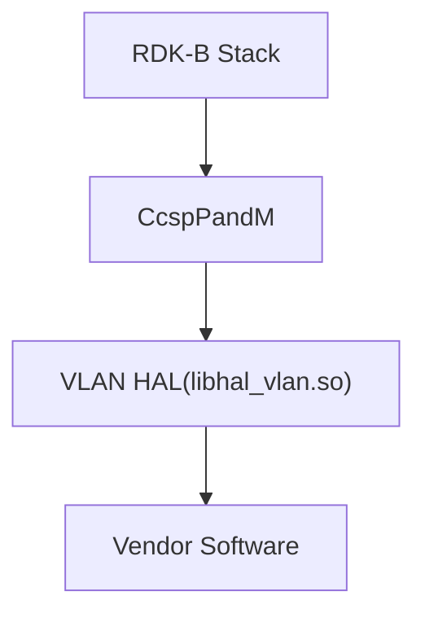
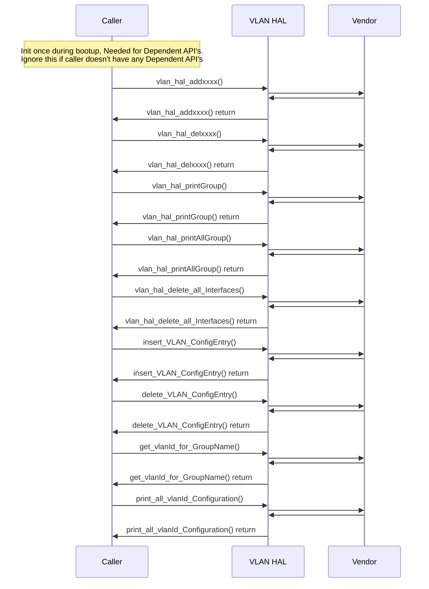

# Virtual LAN HAL Documentation

## Acronyms

- `HAL` \- Hardware Abstraction Layer
- `RDK-B` \- Reference Design Kit for Broadband Devices
- `OEM` \- Original Equipment Manufacture
- `VLAN` \- Virtual LAN

## Description
The diagram below describes a high-level software architecture of the VLAN (Virtual LAN) HAL module stack.
### Overview of the VLAN HAL Module

The VLAN HAL (Virtual Local Area Network Hardware Abstraction Layer) is a component within the RDK-B (Reference Design Kit for Broadband) framework designed to simplify the management of VLAN configurations on network devices.

### Key Functionalities:

- **Initialization:** Prepares the HAL for operation, typically by setting up internal data structures or communicating with the underlying hardware.
VLAN Creation and Deletion: Allows the creation of new VLANs with specified IDs and names, and the removal of existing VLANs.
- **Port Association:** Enables the association and disassociation of physical ports with specific VLANs.
- **VLAN Filtering/Tagging:** Configures how VLANs handle incoming and outgoing traffic (untagged, tagged, or transparent).
- **Bridge Mode:** Enables or disables the bridging mode for VLANs, which affects how traffic is forwarded within the network.
- 
### Purpose and Benefits:
- **Standardization:** Provides a consistent interface for interacting with VLANs, regardless of the underlying hardware or vendor implementation. This allows RDK-B components to work seamlessly with various networking equipment.
- **Abstraction:** Hides the complexity of VLAN configuration and management from higher-level software components, making it easier to develop and maintain networking applications.

VLAN HAL is an abstraction layer, implemented to interact with the underlying software through a standard set of APIs to add / delete / print VLAN group / interface.

   
## Component Runtime Execution Requirements

### Initialization and Startup

There is no dependent API's is expected to be intialized for invoking VLAN HAL client module.

3rd party vendors will implement appropriately to meet operational requirements. This interface is expected to block if the hardware is not ready.

## Threading Model

Vendors may implement internal threading and event mechanisms to meet their operational requirements. These mechanisms must be designed to ensure thread safety when interacting with HAL interface. Proper cleanup of allocated resources (e.g., memory, file handles, threads) is mandatory when the vendor software terminates or closes its connection to the HAL.

This interface is not inherently thread-safe. It is the responsibility of the calling module or component to ensure that all interactions with the APIs are properly synchronized.

### Implementation Guidance for Vendors:

Vendors are free to use internal threading or event mechanisms within their implementation as needed to fulfill operational requirements. However, any such mechanisms must:

- **Synchronize Access:** Implement appropriate synchronization primitives (e.g., mutexes, semaphores) to prevent race conditions and ensure data integrity when accessing the APIs.
- **Resource Management:** Ensure proper cleanup and release of any resources (e.g., memory, threads) allocated during the lifetime of the instance, especially during module shutdown or disconnection.

## Process Model

All APIs are expected to be called from multiple processes. Due to this concurrent access, vendors must implement protection mechanisms within their API implementations to handle multiple processes calling the same API simultaneously. This is crucial to ensure data integrity, prevent race conditions, and maintain the overall stability and reliability of the system.

## Memory Model

### Caller Responsibilities:
- Manage memory passed to specific functions as outlined in the API documentation. This includes allocation and deallocation to prevent leaks.

### Module Responsibilities:
- Modules must allocate and de-allocate memory for their internal operations, ensuring efficient resource management.
- Modules are required to release all internally allocated memory upon closure to prevent resource leaks.
- All module implementations and caller code must strictly adhere to these memory management requirements for optimal performance and system stability. Unless otherwise stated specifically in the API documentation.
- All strings used in this module must be zero-terminated. This ensures that string functions can accurately determine the length of the string and prevents buffer overflows when manipulating strings.

## Power Management Requirements

The HAL is not involved in any of the power management operation.
Any power management state transitions WILL AFFECT affect the operation of the VLAN HAL.

## Asynchronous Notification Model

There are no asynchronous notifications.

## Blocking calls

**Synchronous and Responsive:** All APIs within this module should operate synchronously and complete within a reasonable timeframe based on the complexity of the operation. Specific timeout values or guidelines may be documented for individual API calls.

**Timeout Handling:** To ensure resilience in cases of unresponsiveness, implement appropriate timeouts for API calls where failure due to lack of response is a possibility. Refer to the API documentation for recommended timeout values per function.

**Non-Blocking Requirement:** Given the single-threaded environment in which these APIs will be called, it is imperative that they do not block or suspend execution of the main thread. Implementations must avoid long-running operations or utilize asynchronous mechanisms where necessary to maintain responsiveness.

## Internal Error Handling

**Synchronous Error Handling:** All APIs must return errors synchronously as a return value. This ensures immediate notification of errors to the caller.
**Internal Error Reporting:** The HAL is responsible for reporting any internal system errors (e.g., out-of-memory conditions) through the return value.
**Focus on Logging for Errors:** For system errors, the HAL should prioritize logging the error details for further investigation and resolution.

## Persistence Model

There is no requirement for HAL to persist any setting information. The caller is responsible to persist any settings related to their implementation.

## Non functional requirements

Following non functional requirement should be supported by the component.

## Logging and debugging requirements

The component is required to record all errors and critical informative messages to aid in identifying, debugging, and understanding the functional flow of the system. Logging should be implemented using the syslog method, as it provides robust logging capabilities suited for system-level software. The use of `printf` is discouraged unless `syslog` is not available.

All HAL components must adhere to a consistent logging process. When logging is necessary, it should be performed into the `vlan_vendor_hal.log` file, which is located in either the `/var/tmp/` or `/rdklogs/logs/` directories.

Logs must be categorized according to the following log levels, as defined by the Linux standard logging system, listed here in descending order of severity:

- **FATAL:** Critical conditions, typically indicating system crashes or severe failures that require immediate attention.
- **ERROR:** Non-fatal error conditions that nonetheless significantly impede normal operation.
- **WARNING:** Potentially harmful situations that do not yet represent errors.
- **NOTICE:** Important but not error-level events.
- **INFO:** General informational messages that highlight system operations.
- **DEBUG:** Detailed information, typically useful only when diagnosing problems.
- **TRACE:** Very fine-grained logging to trace the internal flow of the system.

Each log entry should include a timestamp, the log level, and a message describing the event or condition. This standard format will facilitate easier parsing and analysis of log files across different vendors and components.

## Memory and performance requirements

**Client Module Responsibility:** The client module using the HAL is responsible for allocating and deallocating memory for any data structures required by the HAL's APIs. This includes structures passed as parameters to HAL functions and any buffers used to receive data from the HAL.

**Vendor Implementation Responsibility:** Third-party vendors, when implementing the HAL, may allocate memory internally for their specific operational needs. It is the vendor's sole responsibility to manage and deallocate this internally allocated memory.

## Quality Control

To ensure the highest quality and reliability, it is strongly recommended that third-party quality assurance tools like `Coverity`, `Black Duck`, and `Valgrind` be employed to thoroughly analyze the implementation. The goal is to detect and resolve potential issues such as memory leaks, memory corruption, or other defects before deployment.

Furthermore, both the HAL wrapper and any third-party software interacting with it must prioritize robust memory management practices. This includes meticulous allocation, deallocation, and error handling to guarantee a stable and leak-free operation.

## Licensing

VLAN HAL implementation is spected to released under the Apache License 2.0.

## Build Requirements

The source code should be capable of, but not be limited to, building under the Yocto distribution environment. The recipe should deliver a shared library named as `libhal_vlan.so`.

## Variability Management

The role of adjusting the interface, guided by versioning, rests solely within architecture requirements. Thereafter, vendors are obliged to align their implementation with a designated version of the interface. As per Service Level Agreement (SLA) terms, they may transition to newer versions based on demand needs.

Each API interface will be versioned using [Semantic Versioning 2.0.0](https://semver.org/), the vendor code will comply with a specific version of the interface.

## Platform or Product Customization

None

## Interface API Documentation

All HAL function prototypes and datatype definitions are available in `vlan_hal.h` file.

1. Components/Process must include `vlan_hal.h` to make use of VLAN HAL capabilities.
2. Components/Process should add linker dependency for `libhal_vlan`.

## Theory of operation and key concepts

### Example VLAN Configuration on the Puma6 Platform

The VLAN HAL module provides a simplified way to manage VLANs on the Puma6 platform. The following example demonstrates how to create and configure various VLAN groups to separate network traffic for different purposes:

**Private Network (VLAN 100)**

- **Bridge:** brlan0
- **Interfaces:**
  - `eth_1` (external switch port 1)
  - `eth_2` (port 2)
  - `eth_3` (port 3)
  - `MoCA.100` (MoCA VLAN 100)
  - `ath0` (2.4G Wi-Fi VLAN 100)
  - `ath1` (5G Wi-Fi VLAN 100)
- **Commands:**
  - `vlan_hal_addGroup`("brlan0", "100");
  - `vlan_hal_addInterface`("brlan0", "l2sd0", NULL);
  
**Xfinity Home (VLAN 101)**

- **Bridge:** brlan1
- **Interfaces:**
  - `eth_4` (port 4)
  - `MoCA.101` (MoCA VLAN 101)
  - `ath2` (2.4G Wi-Fi VLAN 101)
  - `ath3` (5G Wi-Fi VLAN 101)
- **Commands:**
  - `vlan_hal_addGroup`("brlan1", "101");
  - `vlan_hal_addInterface`("brlan1", "l2sd0", NULL);
  
**Xfinity WiFi 2.4G (VLAN 102)**

- **Bridge:** brlan2
- **Interfaces:**
  - `gretap0.102` (GRE tunnel VLAN 102)
  - `MoCA.102` (MoCA VLAN 102)
  - `ath4` (2.4G Wi-Fi VLAN 102)
- **Commands:**
  - `vlan_hal_addGroup`("brlan2", "102");
  - `vlan_hal_addInterface`("brlan2", "l2sd0", NULL);
  - `vlan_hal_addInterface`("brlan2", "gretap0", NULL);
  
**Xfinity WiFi 5G (VLAN 103)**

- **Bridge:** brlan3
- **Interfaces:**
  - `gretap0.103` (GRE tunnel VLAN 103)
  - `MoCA.103` (MoCA VLAN 103)
  - `ath5` (5G Wi-Fi VLAN 103)
- **Commands:**
  - `vlan_hal_addGroup`("brlan3", "103");
  - `vlan_hal_addInterface`("brlan3", "l2sd0", NULL);
  - `vlan_hal_addInterface`("brlan3", "gretap0", NULL);
  
**Key Points:**

- Each VLAN group is associated with a unique bridge name and VLAN ID.
- Interfaces (Ethernet, MoCA, Wi-Fi, GRE tunnels) are added to the VLAN groups using the `vlan_hal_addInterface` function.
- This modular approach allows for flexible network segmentation and isolation of traffic for different services.
- This specific example uses a Puma6 platform and may need to be adapted for other environments.

## Sequence Diagram

